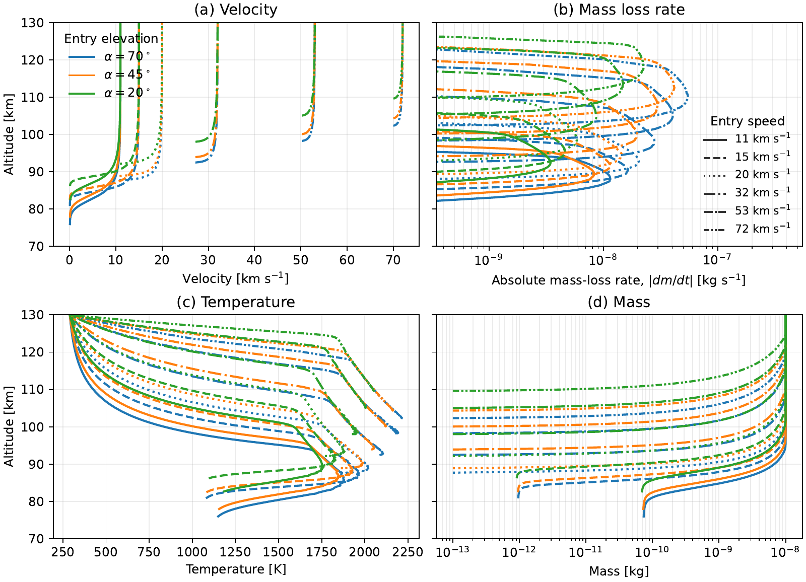
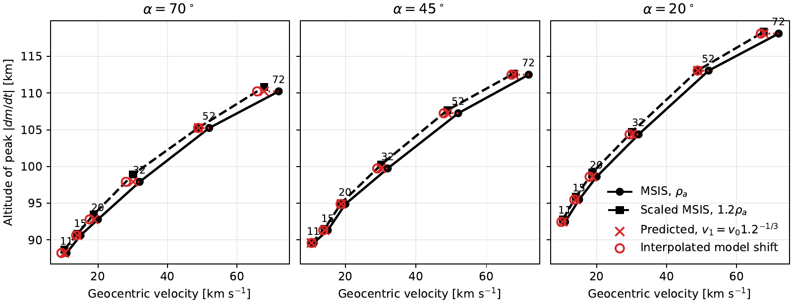
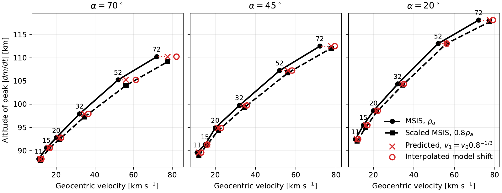

# Ablation-model paper figures

This repository contains the development version of the code used to generate
the ablation-model figures for *On the relationship between atmospheric neutral
density and meteor head echo detection height*.

The implementation uses the `KeroSzasz2008` model from
[`ablate`](https://github.com/jvierine/ablate) (imported as `metablate`) and the
MSIS 2.1 atmosphere.

Run the figure generator from the repository root:

    conda run -n base python make_cabmod_figures.py

It writes the following files under `figures/`:

- `meteor_ablation_single_column.pdf`
- `peak_ablation_height-1.20.pdf`
- `peak_ablation_height-1.00.pdf`
- `peak_ablation_height-0.80.pdf`
- `velocity_shift_table.tex`

Install `ablate` into the active Python environment, or place an `ablate`
checkout next to this repository so that `../ablate/src` is available.

## Reproduction and extension to 11 km/s

The reproduction runner archives the model inputs, Python sources, dependency
versions, atmosphere, full trajectories, and table values in HDF5. It preserves
the paper's equations and peak definition. The extended run adds 11, 15, and
20 km/s to the original speed families and increases the maximum integration
duration to 30 seconds to capture the low-speed peaks.

Prepare sibling code checkouts and dependencies:

```bash
git clone https://github.com/jvierine/sabmod.git
git clone https://github.com/danielk333/ablate.git
git -C ablate checkout c2c8b34a5b5986f3f1a59363786e3b162ddde1e5
cd sabmod
conda run -n base python -m pip install -e ../ablate
conda run -n base python -m pip install -r requirements-reproduction.txt
```

Run the original reproduction or the extended speed family:

```bash
conda run --no-capture-output -n base python -u reproduce_paper.py
conda run --no-capture-output -n base python -u reproduce_paper.py --extend-down-to 11 --extra-velocity 15
conda run --no-capture-output -n base python -u check_paper_numerics.py
```

Use `--extra-velocity` repeatedly to add other speeds and `--output-dir` to
choose an output directory. If an Overleaf checkout is present under `paper/`,
the runner uses its generator; otherwise it uses the generator in this repo
and the saved reference table under `reference/`.

The original [reproduction record](reproduction/README.md) documents agreement
with the paper and numerical sensitivity. The
[extended-run record](reproduction_extended/README.md) documents the wider
velocity range. Both contain HDF5 outputs and LaTeX captions with script
provenance enabled by default. The model uses `ablate`; its GPL license is
included under `licenses/` for the source snapshots embedded in the archives.

### Extended profiles



### Density increase by 20 percent



### Density decrease by 20 percent



The low-speed runs can retain mass at the end of the calculation. All 57
extended cases completed successfully and their sampled mass-loss peaks
occur inside the integration interval. The original-range mean inferred
density factors reproduce as 1.309 and 0.717, but not every individual
printed table entry matches exactly. Halving the maximum time step changes
representative peak heights by up to 0.35 km; the records retain this numerical
limitation.
