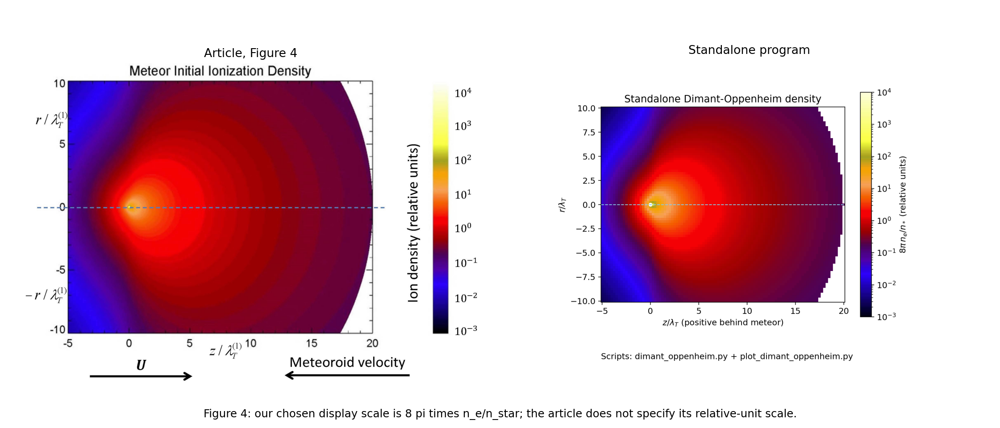
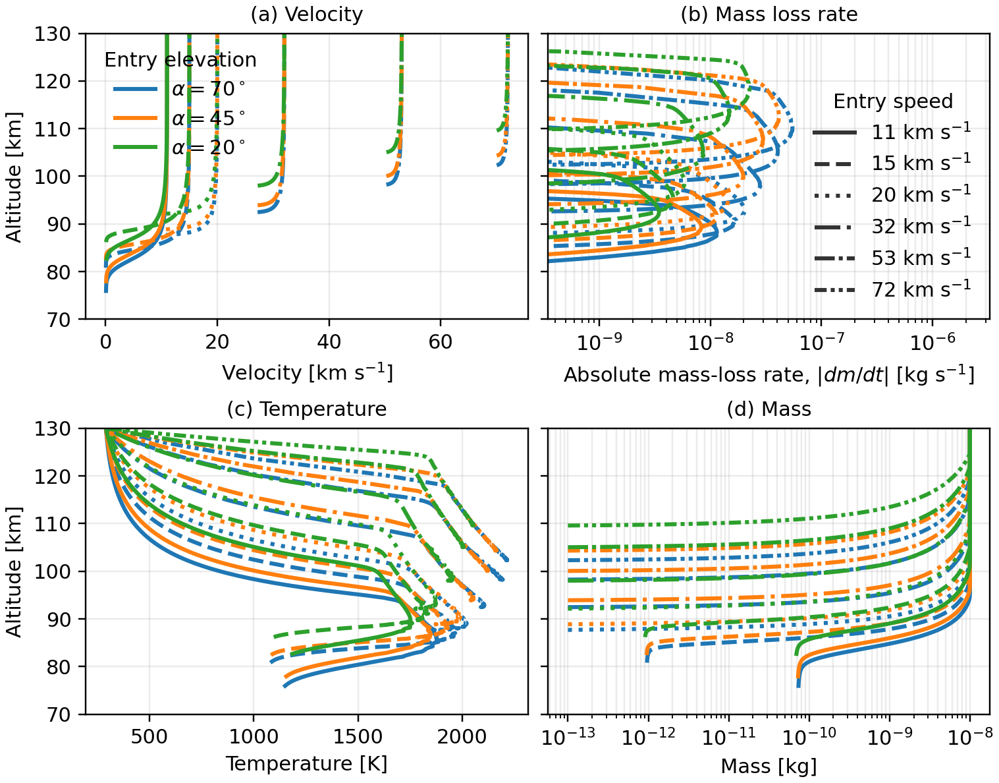
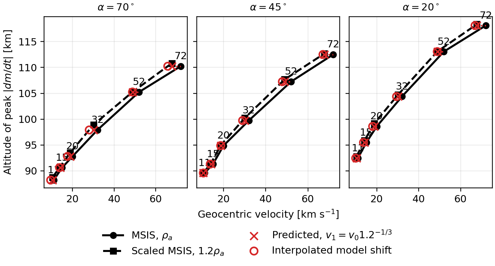
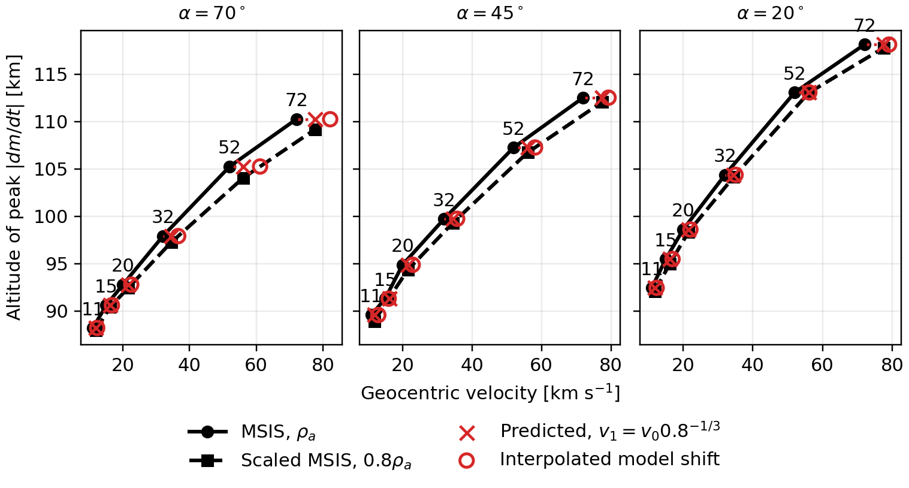

# Ablation-model paper figures

## Simple Dimant-Oppenheim density function

[`dimant_oppenheim.py`](dimant_oppenheim.py) contains the standalone
`electron_density(z, r)` function from Dimant & Oppenheim (2017), Eqs. 45-48.
It depends only on NumPy and SciPy. Coordinates are in ablated-neutral mean
free paths; positive `z` is behind the meteor. The return value is `ne/n_star`,
with `n_star` defined in the module docstring. Multiply by a physical `n_star`
to obtain electron density in m^-3.

```sh
conda run -n base python -m pip install -r requirements-density.txt
conda run -n base python plot_dimant_oppenheim.py
conda run -n base python compare_article.py
conda run -n base python -m pytest test_dimant_oppenheim.py -q
```

Generated PNG/PDF figures, HDF5 arrays, and the LaTeX figure snippet are in
`figures/dimant_oppenheim/`. Figure 3 uses the paper's stated normalization
`pi*ne/n_star`. Figure 4 uses the explicitly chosen display scale
`8*pi*ne/n_star`, since its caption specifies relative units without giving
the scale. Script provenance is shown by default; the plotting script and
LaTeX snippet provide toggles to hide it.

Reference images and their source are documented in
[`reference/dimant_oppenheim/README.md`](reference/dimant_oppenheim/README.md).



## Ablation profiles

Generate all paper figures with current upstream
[metablate](https://github.com/danielk333/ablate), without a special checkout,
historical revision, extension flags, or reproduction wrapper.

Install/update dependencies once:

```sh
conda run -n base python -m pip install --upgrade -r requirements-figures.txt
```

Then run:

```sh
conda run -n base python make_cabmod_figures.py
```

The default profiles include **11, 15, 20, 32, 53, 72 km/s**, at entry
elevations 70, 45, and 20 degrees. Density comparisons use 11, 15, 20, 32,
52, and 72 km/s (the 52/53 distinction matches the reference figures), with
MSIS density factors **1.2, 1.0, and 0.8**. All runs allow 30 seconds to
capture low-speed heating peaks.

Outputs in `figures/`: four PDFs and PNGs, `velocity_shift_table.tex`, and
`cabmod_results.h5`. The archive stores all 57 distinct trajectories, generating
source, and installed dependency provenance. Finite trajectories and interior
mass-loss peaks are checked. A time-limited track with mass remaining does
not establish complete ablation or surface delivery.

These are Kero-Szasz/metablate calculations, not multicomponent CABMOD chemistry
despite the historical script name. Current package equations are used without
historical-source patches. Small differences from old screenshots are expected.
The published run used upstream `c31ef4e` (metablate 0.2.0): provenance, not a
required revision.





See [figure notes](README_figures.md) and `figure_captions.tex` for article
inclusion with script provenance shown by default. Figures use the manuscript's
177 mm text width and fonts at least 10 pt.

Fast checks:

```sh
conda run -n base python -m unittest test_make_cabmod_figures.py
```

`reproduce_paper.py`, `extended_paper_plots.py`, and `reproduction*` are retained
as historical records targeting the older package API, not the current workflow.
The [numerical sensitivity discussion](reproduction_extended/README.md) remains
relevant: representative peak heights shifted by up to 0.35 km when the
integration step was halved. Figure generation is not physical validation.
